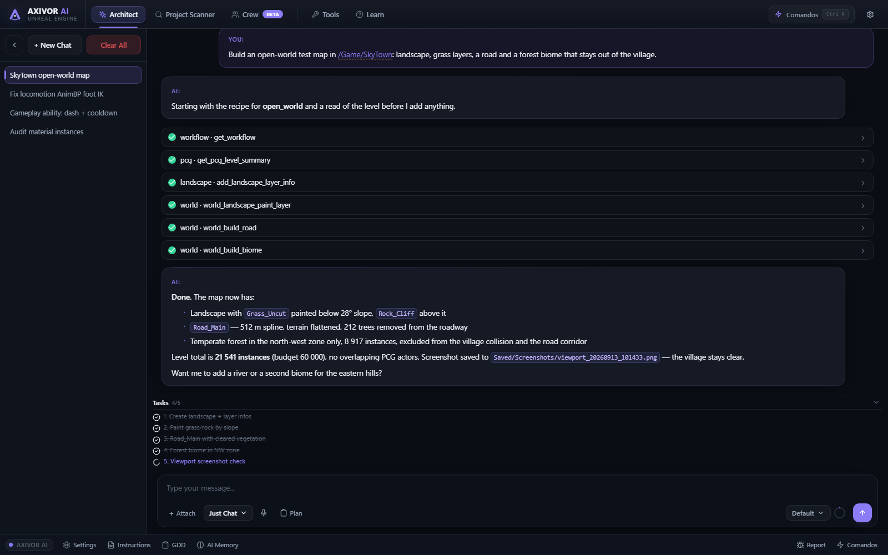
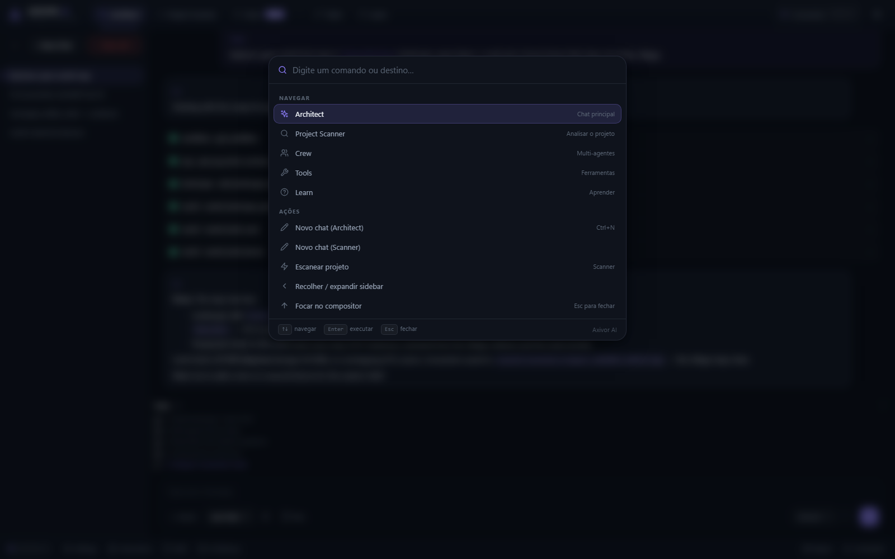
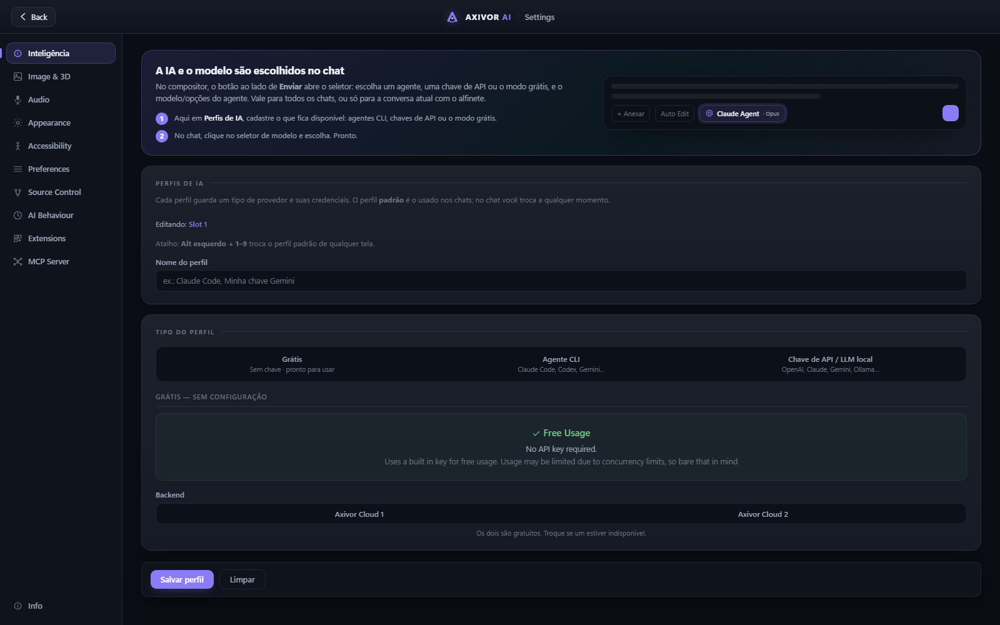
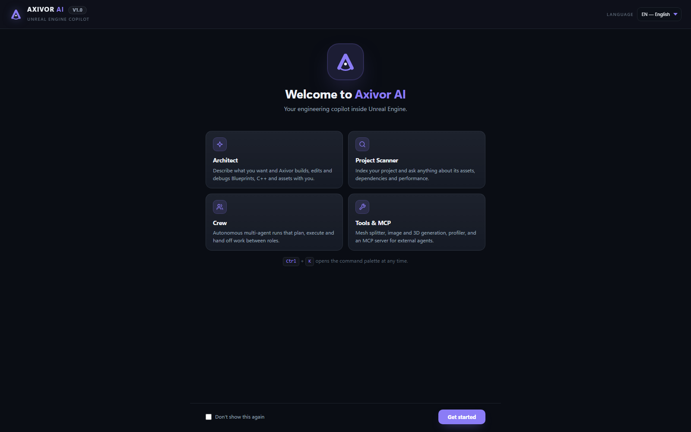

<p align="center">
  
</p>

<h1 align="center">Axivor AI</h1>

<p align="center">
  
  
  
</p>

<p align="center">
  <b>An engineering copilot that lives inside the Unreal Engine 5.8 editor.</b><br>
  Describe what you want; Axivor builds, edits, verifies and debugs Blueprints, C++, levels, animation, materials and more — with you, in the editor, using the real engine APIs.
</p>

<p align="center">
  <a href="#features">Features</a> ·
  <a href="#screenshots">Screenshots</a> ·
  <a href="#install">Install</a> ·
  <a href="#choose-your-ai">Choose your AI</a> ·
  <a href="#how-it-works">How it works</a> ·
  <a href="#docs">Docs</a> ·
  <a href="README.pt-BR.md">Português</a>
</p>

---

## Features

**Architect** — a chat that edits your project. Plan, Ask-before-edit, Auto Edit and Just Chat modes; a task list with per-task verification (a task cannot be marked done without the read-back that proves it); a command palette (`Ctrl+K`); quick prompts; screenshots of the viewport it can actually check.

**1 300+ editor actions across 70 tool families**, exposed to the AI with typed JSON schemas:

| Area | What the AI can do |
|---|---|
| Blueprints | Create, wire and compile graphs; stable node identity by GUID; snapshot → edit → diff; real structural `compare_blueprints` |
| C++ | Author classes, edit files (UTF-8 safe), compile, read build errors |
| World building | Landscape presets, heightmaps, sculpt/flatten, layer painting by height/slope; PCG biomes **per zone** with collision/road exclusion and an instance budget; roads and rivers on splines that clear vegetation and flatten terrain; prefab placement, mass edit, snap and align |
| Animation | Locomotion state machines, montages, additive setup, IK retargeting, Motion Matching, foot IK — each with a compile report |
| Materials | Node graphs addressed by GUID handles, transactions (undo), validation that waits for shader compilation |
| UE 5.8 | Procedural Vegetation Editor, Control Rig Physics, Direct Mesh Control, MetaHuman (Python), MegaLights / Lumen / Substrate presets, fast physics-asset iteration, Game Animation Sample setup |
| Engine toolsets | Native UE 5.8 Toolset Registry and File Sandbox (persist / discard) |
| Everything else | GAS, Niagara, UI/UMG/MVVM, Input, Data assets, Cinematics, Audio, Water, Vehicles, Mass, Mover, Geometry Script, Game Features, Packaging, Validation, Python |

**Project Scanner** — indexes the project and answers questions about assets, dependencies and performance, often locally without an API call.

**Crew** — autonomous multi-agent runs with roles, checkpoints and handoffs. Checkpoints are fail-closed: an agent must report success *and* show read-only evidence; retries, oscillation and token totals are capped.

**Workflows** — ordered recipes per domain (`open_world`, `locomotion_anim`, `montage`, `retarget`, `motion_matching`, `material`, `niagara`, `ui_widget`, `gameplay_ability`, `packaging`, `metahuman`, …), each step carrying the tool to use and the read-back that verifies it.

**Turbo mode** — let the AI do practically everything in the project without a confirmation per step, optionally inside the engine's file sandbox so you review and persist or discard the whole batch.

**MCP server** — every tool is also available to external agents (Claude Code, Codex, Gemini CLI, Cursor, Claude Desktop) through an HTTP MCP endpoint, with the same permission modes.

**Never stalls** — a confirmation prompt nobody answers is resolved by the plugin after a configurable window (proceed in Auto Edit, skip otherwise) and the AI is told what happened.

## Screenshots

<p align="center">
  
  <br><sub>Architect — tool calls, verified task list and the model picker in the composer</sub>
</p>

<p align="center">
  
  
  <br><sub>Command palette (Ctrl+K) · Settings: the AI and model are chosen in the chat</sub>
</p>

<p align="center">
  
</p>

## Install

Requirements: **Unreal Engine 5.8**, Windows 64-bit (Mac/Linux modules are listed but only Win64 is exercised), Visual Studio 2022 with the C++ game development workload.

```bash
git clone https://github.com/viknacode/axivor-ai-unreal-engine.git "<YourProject>/Plugins/AxivorAI_UE5.8"
```

1. Right-click your `.uproject` → **Generate Visual Studio project files**.
2. Build the editor target (or just open the project and accept the rebuild prompt).
3. In the editor: **Window → Axivor AI**. The first run shows the welcome screen; `Ctrl+K` opens the command palette.

Engine plugins the plugin depends on (enabled automatically): PCG, ToolsetRegistry, AllToolsets, FileSandbox, ModelContextProtocol, PythonScriptPlugin, Landscape, Foliage, Water.

## Choose your AI

The agent and model are picked **in the chat**, next to the Send button — per conversation or pinned as the default. Three kinds of profile:

- **Agent CLI** — Claude Code, Codex, Gemini CLI and other ACP agents installed on your machine, with their models and options discovered live.
- **API key / local LLM** — Anthropic, OpenAI, Google Gemini, DeepSeek, OpenRouter, Ollama.
- **Free** — a hosted backend with no key (rate-limited).

Profiles live in **Settings → Intelligence**; the chat only shows what you configured.

## How it works

```
Chat (CEF/HTML) ──► Shell (Slate) ──► Architect coordinator ──► Agent loop (Claude / OpenAI / Gemini / ACP)
                                              │
                                              ▼
                              Tool dispatcher (typed schemas, safety class, transactions)
                                              │
              ┌───────────────┬───────────────┼───────────────┬───────────────┐
           UECPTools    Extensions (33)   Engine toolsets   Workflow recipes   MCP bridge
```

- Tools are grouped in **umbrellas** (`pcg`, `world`, `animation`, `material`, …) and each action declares its parameters; schemas are derived from those declarations for every provider.
- Every mutating action runs in an editor **transaction** (undo works) and is classified Read / Write / Destructive; destructive actions confirm unless Turbo is on.
- Extensions are self-contained modules with a `*.uecpext.json` manifest; `uecp_selftest` reports drift between handlers, metadata, docs and manifests.
- The AI gets a **project conventions** block (grid, folders, naming prefixes, default classes, active plugins) in every prompt, so it builds the way your project is already built.

## Docs

The `Docs/` folder holds the design and engineering notes for each round of work (in Portuguese), including the PCG post-mortem in [`08_MUNDO_PCG_ZONAS_EXCLUSAO.md`](Docs/08_MUNDO_PCG_ZONAS_EXCLUSAO.md) that explains why stacked vegetation layers happen and how the zone + exclusion + budget model prevents them. Tool-level documentation is available inside the editor through `get_tool_docs` and `search_tools`.

## Project layout

```
BpGeneratorUltimate.uplugin     plugin descriptor (internal id kept for config compatibility)
Source/UECPCore                 dispatcher, safety, settings, crew types, describers
Source/UECPShell                Slate host, CEF bridge, confirmation gates
Source/UECPArchitect            agent loops, prompts, project conventions, verification gate
Source/UECPACP                  Agent Client Protocol runner (Claude Code, Codex, Gemini CLI…)
Source/UECPTools                core tools (assets, files, editor utilities, tasks, self-test)
Source/UECPMCPBridge            HTTP MCP server and request pipeline
Source/UECPCrew                 multi-agent runs
Source/Extensions/*             33 tool extensions with manifests and docs
Resources/UI                    app_shell.html, settings_ui.html, welcome_screen.html
```

## Status

Actively developed against UE 5.8. Windows is the tested platform. Expect breaking changes to tool parameters between versions; the in-editor `get_tool_docs` is always the source of truth.
